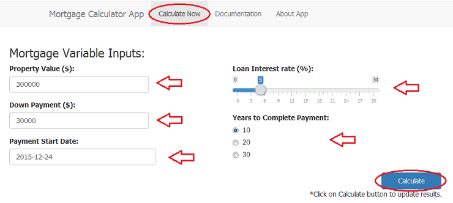
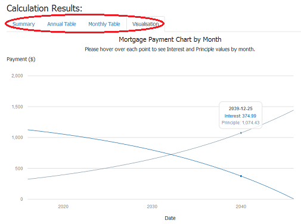

### Overview

The Mortgage Calculator App provides a quick and easy way to estimate calculation of mortgage monthly payment, interest, principle and balance values. Mortgage calculation is based on formulas found [here](http://www.hughcalc.org/formula.php) where mortgages are compounded monthly. 

### Easy to use!

Navigate to the application page by clicking on `Calculate Now` on the navigation bar at the top of the shiny site and just provide details of the mortgage at the `Mortgage Variable Inputs` section. Then, remember to click on the `Calculate` button at the bottom right of the `Mortgage Variable Inputs` section when you are ready to update the `Calculation Results`.



--- .class #id 

### Click the `Calculate` button and voila!  

At the `Calculation Results` section, summary, tables and charts are organised in neat tabs:
- `Summary` tab includes a summary of the mortgage details and calculated monthly payment value.
- `Annual Table` tab shows the estimated interest and principle payment values as well as remaining balance for each year.
- `Monthly Table` tab shows the estimated interest and principle payment values as well as remaining balance for each month.
- `Visualisation` tab displays an interactive Mortgage Payment Chart by Month.



--- .class #id 

### Calculations with R

The calculation of monthly payment is done using the R function below:

```{r}
calcMonthlyPayment <- function(principle, monthlyInterest, monthsToPay) {
  return(round(principle * (monthlyInterest/(1-(1+monthlyInterest)^(-monthsToPay))), digits = 2))
}
```

This is demonstrated below with property value $300000, down payment $30000, yearly loan interest rate 5% and total loan payment years equals to 10.

```{r}
# Example calculation of monthly payment
principle <- 300000 - 30000  #principle = propertyValue - downPayment
monthlyInterest <- 5/(12*100)   #monthlyInterest = yearlyInterest/(12*100) 
monthsToPay <- 10 * 12   #monthsToPay = yearsToPay * 12
calcMonthlyPayment(principle, monthlyInterest, monthsToPay)
```

--- .class #id 

### Calculations with R (continued...)

Procedure to create annual and monthly payment tables:

1. Current month interest payment (`cuMonthInterest`) equals to loan `balance` multiply by `monthlyInterest`.
2. Principle payment for the current month (`cuMonthPrinciple`) equals to monthly payment calculated above minus `cuMonthInterest`.
3. Next new loan `balance` is then equals to old `balance` minus `cuMonthPrinciple`.
4. Procedure is repeated from step one through step three with the new loan `balance` until loan `balance` is zero. 


### Quick instructions any time

You can refer to the `Documentation` tab on the navigation bar any time at the top of the shiny site which gives a simple description on how to use the Mortgage Calculator App. You can also check out the `About App` tab to view details about the application.


### Go to application link now

Mortgage Calculator Application link in Rstudio shiny server: https://yuriauyong.shinyapps.io/wk3Proj
